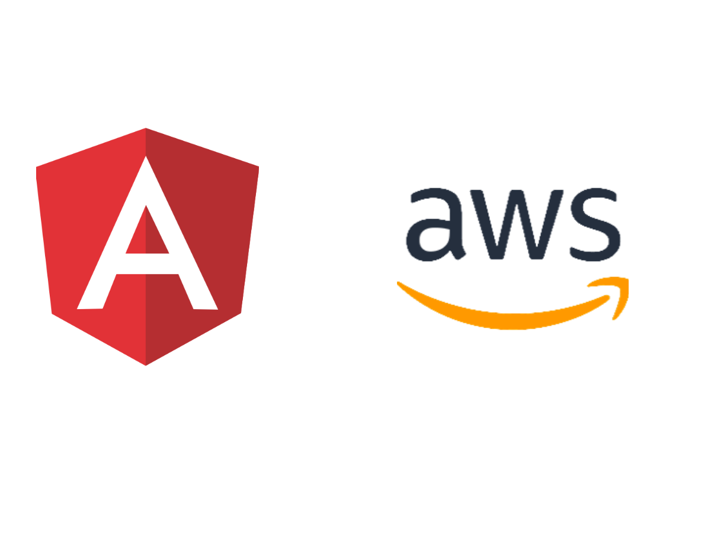

In this article, I will show how to automate your deployment of the angular app to [AWS S3](https://aws.amazon.com/s3/) service by creating a pipeline on [AWS Codepipeline](https://aws.amazon.com/codepipeline/) service or in short we will do CI/CD for an angular project. In Case, you are wondering what are these AWS services, 

### AWS Codepipeline
AWS CodePipeline is a fully managed continuous delivery service that helps you automate your release pipelines for fast and reliable applications. [Read more here](https://aws.amazon.com/codepipeline/)

### AWS S3
Amazon Simple Storage Service (Amazon S3) is an object storage service that offers industry-leading scalability, data availability, security, and performance. [Read more here](https://aws.amazon.com/s3/).

As this article is more focused on automating deployment I will not discuss these AWS services in detail. So, enough talk, let's see it practically, which I had break-in steps.

So the first step is,

### 1) Create an Angular Project
Most of the time, you probably have a project which you want to deploy, but if you just want to play with it you obviously have to create it by typing in the command prompt:
```javascript
ng new angular-aws-app
```
where `angular-aws-app` will be your app name.

Now after successfully creating your project, go to [github.com](https://github.com) and create a repository for your app and push your code to your repo master branch. 
<br />

### 2) Create Pipeline on AWS Code-Pipeline service

After pushing your initial code on Github, we need to create a pipeline or an automated process that will be responsible for deploying our code to Amazon S3 from Github repo. But for this, you will need an AWS account so that you can access their services. [Here](https://aws.amazon.com/resources/create-account/) you can create your account for free tier which will be free for 365 days. After creating your account you will see a dashboard console.
<br /><br />


Type `code pipeline` and click to that service and go to pipelines in the sidebar to create a new pipeline for our app. You'll see an orange button on the top right corner to create a new pipeline. <br /><br />


First, we set up our pipeline name to `ng-app-pipeline` and select `New Service Role` for setup role service as it is our new brand pipeline. After setting the pipeline name, click next for the next step.<br /><br />


In step 2 of pipeline creation, we have to provide our source control from where it will get our code to build and deploy to s3. In our case, we will select <b>Github</b> as we pushed our code to Github. After selecting Github, click on the `Connect to Github` button and provide your repository with its production branch which is usually `master` for most of us and click next for the next step.<br /><br />


Now in Add Build Stage step, we have to provide which service we are using for creating a staging build, so we have selected `AWS CodeBuild` service which is a service for AWS, you can select `Jenkins` if you are using it. Select your region and create new project for it. A new window will open and you will provide details of your build project.

#### In project configuration,
provide a project name for your build project. It could be any name you want.

#### In Environment,
Select the 
operating system:  <b>ubuntu</b>,
Runtime: <b>Standard</b>,
Image: <b>aws/codebuild/standard:1.0</b>,
Image Version: <b>always use latest image for this runtime version</b>,

Now click on `Continue to CodePipeline` for creating the build project.
After successfully creating a building project, click next for the deploy stage.


Now Select s3 as deploy provider as we will host our app on AWS s3. You can choose which region you are using and for bucket option, we have to create a new bucket or select an existing bucket where we will host our application build files and check `Extract file before deploy` because after build process our build files have archived and we have to extract build archive to files for storing in s3. After these steps, click next for reviewing all of the configuration steps which you have made before.

After reviewing, click on the `create pipeline` button and you'll see your pipeline for source, build & deploy.


#### Buildspec.yaml
We just have done set up the automation process in AWS code pipeline service, now we have to create `buildspec.yaml` file in the root folder of our angular project. This is an important part of Continuous Integration, so we have to add our scripts carefully, otherwise, the build process will not succeed. 

Here's what `buildspec.yaml` file looks like,

```yaml
version: 0.1

phases:
  install:
    commands:
      - echo installing nodejs...
      - curl -sL https://deb.nodesource.com/setup_12.x | bash -
      - apt-get install -y nodejs
      - echo installing yarn...
      - curl -sS https://dl.yarnpkg.com/debian/pubkey.gpg | apt-key add -
      - echo "deb https://dl.yarnpkg.com/debian/ stable main" | tee /etc/apt/sources.list.d/yarn.list
      - apt install --no-install-recommends yarn
  pre_build:
    commands:
      - echo installing dependencies...
      - npm i -g @angular/cli
      - npm install
  build:
    commands:
      # - echo testing...
      # - echo building...
      - ng build --prod
artifacts:
  files:
    - "**/*"
  discard-paths: no
  base-directory: dist/your-app-name

```

Buildspec.yaml consist of phases of scripts, like in `phases` part first script is for installing `nodejs` with `yarn`. Let's look it one by one.

### 1) curl -sL https://deb.nodesource.com/setup_12.x | bash -
This command is responsible for downloading node.js version 12 tar file in the ubuntu container (environment for hosting our app)

### 2) apt-get install -y nodejs
If you're familiar with ubuntu, you'll know what `apt-get` does. It will install node.js in our container from that downloaded tar file.


### 3) curl -sS https://dl.yarnpkg.com/debian/pubkey.gpg | apt-key add -
This command is for downloading the `yarn` package manager tar file. It's not mandatory to do it but I prefer it over `npm` commands.

### 4) apt install --no-install-recommends yarn
This command is for installing the `yarn` package manager.

Now in <b>Pre-Build</b> section,
We have to provide commands for installing dependencies of the project,

### 4) npm i -g @angular/cli
This command will responsible for install angular cli globally so that we can create builds by typing `ng build`. It's a mandatory step, otherwise it will not create a build.

### 5) npm install
This command will install all project-related dependencies which is required to run our app.

Now in <b>build</b> section,
We have to provide commands for creating a build of our project,

### 6) ng build --prod
It will create a production build of the angular project.

Now in <b>artifacts</b> section,
We have to provide files and base-directory name from where it will get build files after creating production build.

### 7) files "**/*"
By this command, it will get all build files and upload it into `AWS S3` services from where it will be hosted.

### 8) base-directory: dist/your-app-name
This will be the directory where your build files are.

Now after creating `buildspec.yaml` file in root, push your code to your repository's master branch, and it will automatically get your source code, create a build and deploy it to S3.


 

You can see from the above image, it will start building our project and you can see the logs from the details button.

Alright, when everything goes perfect, go to S3 service from AWS console and search your bucket. By going to your bucket you'll see your build files. Now go to the `Properties` tab and click `static website hosting` card. Check on `Use this bucket to host a website` option and write `index.html` in index and error document fields and save it. You'll see an endpoint of your application, open it new chrome tab and Boom, your site has been live on AWS S3. 

Do try some changes in your code and push again to master, after creating build and deploy, it will show you the latest changes in your live app.

So that's it guys for automating your angular app to deployment. 
BTW this process is same for react, vue or any framework, you just have to manipulate `buildspec.yaml` file scripts according to your scenario.

I hope you have learned something out of it. Please follow me here for more content like this.

Peace ✌️ ✌️ 