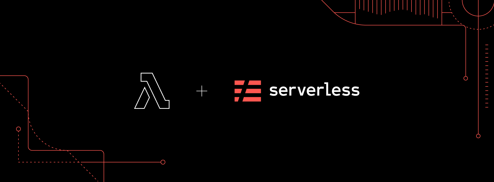

Hello, developers, As we know that there is so much hype about cloud computing or in a single term we can say <b>[Serverless](https://serverless.com/)</b>, so what problems are it exactly solving. Cloud computing is the on-demand availability of computer system resources, especially data storage and computing power, without direct active management by the user. The term is generally used to describe data centers available to many users over the Internet.

if we have to define cloud computing in a single line it would be described as <b>Communications Network</b>.

The word cloud often refers to the <b>Internet</b> and more precisely to some Data-Centers full of servers connected with the Internet.

Well, it really is a vast field of Information Technology, so I will not discuss it briefly. What this article is all about the basics of Serverless and Lambda Functions.

But what exactly is this term <b>Serverless</b>?

## Serverless

[Serverless](https://serverless.com/) or <b>[Serverless Computing](https://serverless.com/)</b> is an architectural model for your application infrastructure, where you don't have to worry about managing your own servers.You don't have to create your own deployment models. You just use someone else servers or machines and pay them what you use it.


Serverless is just a fancy word for someone's servers or Paas (Product as a Service).

## Lambda Functions

We'll use [Lambda Functions](https://aws.amazon.com/lambda/) which is standard cloud functions for AWS. It lets you run code without any provisioning or managing servers. You pay only for the compute time you consume. 

Well talk enough, let's do some practical stuff.

First of all, I am gonna install [Serverless Framework](https://serverless.com/framework/docs/) globally in my machine via npm (node package manager). [Serverless Framework](https://serverless.com/framework/docs/) is a framework that helps you build serverless apps with radically less overhead and cost. It provides a powerful, unified experience to develop, deploy, test, secure and monitor your serverless applications. It provides it's own CLI (command-line interface) where you can manage almost all operations.

Now open your terminal in Linux and command prompt if you are in windows and install serverless framework:

``` javascript
 // Install the serverless CLI
 npm install -g serverless

 // Or, update the serverless CLI from a previous version
 npm update -g serverless
```

You can actually check whether it installs successfully by typing: 
``` javascript
 // where serverless is installed on your machine
 which serverless

 // check all available commands
 serverless --help
```

Now you have to connect with it with your [AWS account](https://aws.amazon.com/free/?all-free-tier.sort-by=item.additionalFields.SortRank&all-free-tier.sort-order=asc). If your account is not created you can [create](https://aws.amazon.com/free/?all-free-tier.sort-by=item.additionalFields.SortRank&all-free-tier.sort-order=asc) one with the free tier for playing around with it.

After creating an account, go to Cloud Console and in <b>IAM service</b> for creating a user. But it's not mandatory. You can create a sub-user and connect with it. The main thing you'll need for connecting your serverless framework CLI to your AWS account is <b>Access Key Id</b> & <b>Secret Access Key</b>, which you'll get at the time of creating your account.

```javascript
// This command will connect your serverless CLI to AWS account 
serverless config credentials --provider aws --key my-access-id --secret my-secret-id

```

where `--provider` flag is for which cloud service you want to connect and `--key` for access key id & `--secret` for secret id. 

If everything works correctly, you'll see this below screen:


In your main Home directory, there will be file saved name as `.aws` which contains your credentials.

So far so good, now create a serverless project based on node.js by command-line interface:

```javascript
// creating a serverless template for node.js
serverless create --template aws-nodejs --path first-lambda-functions --name first-lambda-functions
```

After typing above command you'll see this on your cmd:


Now goto newly created project by changing directory into the project directory: `cd first-lambda-functions`. You'll see two files named `handler.js` & `serverless.yml`.

### Handler.js
`handler.js` is your file where you will write your functions.

### Serverless.yml
`serverless.yml` is your file where all your aws configurations will be written.

In `serverless.yml` you'll see, this code:

```yml
# Welcome to Serverless!
#
# This file is the main config file for your service.
# It's very minimal at this point and uses default values.
# You can always add more config options for more control.
# We've included some commented out config examples here.
# Just uncomment any of them to get that config option.
#
# For full config options, check the docs:
#    docs.serverless.com
#
# Happy Coding!

service: aws-node-example
# app and org for use with dashboard.serverless.com
#app: your-app-name
#org: your-org-name

# You can pin your service to only deploy with a specific Serverless version
# Check out our docs for more details
# frameworkVersion: "=X.X.X"

provider:
  name: aws
  runtime: nodejs12.x

# you can overwrite defaults here
#  stage: dev
#  region: us-east-1

# you can add statements to the Lambda function's IAM Role here
#  iamRoleStatements:
#    - Effect: "Allow"
#      Action:
#        - "s3:ListBucket"
#      Resource: { "Fn::Join" : ["", ["arn:aws:s3:::", { "Ref" : "ServerlessDeploymentBucket" } ] ]  }
#    - Effect: "Allow"
#      Action:
#        - "s3:PutObject"
#      Resource:
#        Fn::Join:
#          - ""
#          - - "arn:aws:s3:::"
#            - "Ref" : "ServerlessDeploymentBucket"
#            - "/*"

# you can define service wide environment variables here
#  environment:
#    variable1: value1

# you can add packaging information here
#package:
#  include:
#    - include-me.js
#    - include-me-dir/**
#  exclude:
#    - exclude-me.js
#    - exclude-me-dir/**

functions:
  currentTime:
    handler: handler.currentTime
    events:
      - http: 
          path: current-time
          method: get
   # The following are a few example events you can configure
   # NOTE: Please make sure to change your handler code to work with those events
   # Check the event documentation for details
#    events:
#      - http:
#          path: users/create
#          method: get
#      - websocket: $connect
#      - s3: ${env:BUCKET}
#      - schedule: rate(10 minutes)
#      - sns: greeter-topic
#      - stream: arn:aws:dynamodb:region:XXXXXX:table/foo/stream/1970-01-01T00:00:00.000
#      - alexaSkill: amzn1.ask.skill.xx-xx-xx-xx
#      - alexaSmartHome: amzn1.ask.skill.xx-xx-xx-xx
#      - iot:
#          sql: "SELECT * FROM 'some_topic'"
#      - cloudwatchEvent:
#          event:
#            source:
#              - "aws.ec2"
#            detail-type:
#              - "EC2 Instance State-change Notification"
#            detail:
#              state:
#                - pending
#      - cloudwatchLog: '/aws/lambda/hello'
#      - cognitoUserPool:
#          pool: MyUserPool
#          trigger: PreSignUp
#      - alb:
#          listenerArn: arn:aws:elasticloadbalancing:us-east-1:XXXXXX:listener/app/my-load-balancer/50dc6c495c0c9188/
#          priority: 1
#          conditions:
#            host: example.com
#            path: /hello

#    Define function environment variables here
#    environment:
#      variable2: value2

# you can add CloudFormation resource templates here
#resources:
#  Resources:
#    NewResource:
#      Type: AWS::S3::Bucket
#      Properties:
#        BucketName: my-new-bucket
#  Outputs:
#     NewOutput:
#       Description: "Description for the output"
#       Value: "Some output value"
``` 
 
Where `service` property will be your project folder, where your functions are. 
`provider` where name is aws as we have chose aws and nodejs which is installed in your machine.
`functions` where our function name which in this case is `currentTime` and handler(path) where your function is saved.

Now let's check our function `handler.js` code: 

```javascript
'use strict';

module.exports.currentTime = async event => {
  return {
    statusCode: 200,
    body: JSON.stringify(
      {
        message: `Current time: ${new Date().toTimeString()}`,
        input: event,
      },
      null,
      2
    ),
  };

  
};
```

We have created a function named `currentTime` which simply returns current date time in string format with `statusCode` 200.

Now in cmd if you type:

```javascript
// invoking function locally
serverless invoke local --function currentTime
```
you'll get your response:

```bash
{
    "statusCode": 200,
    "body": "{\n  \"message\": \"Current time: 18:17:02 GMT+0000 (Coordinated Universal Time)\",\n  \"input\": {}\n}"
}

```

But the whole purpose of this article is to show you how to deploy this function. So we'll do type:

```javascript
//deploying to AWS via serverless
serverless deploy
```

During this process whole services are packaged, a cloud formation stack is created and eventually, the whole thing is deployed.


Now the URL provided in the GET endpoint is your lambda function URL.

You can try using `cURL` to find the response of this URL, by typing:

```bash
  curl https://ipfs3cwa7g.execute-api.us-east-1.amazonaws.com/dev/current-time
```

And you'll see your response to the terminal.

If you go to your AWS cloud console and go to <b>cloudformation</b> service, you'll see your deployed function details for every operation done on that function. Like below is my console screen.


🎉🎉 So finally, you deploy your first ever Lambda function to AWS. 🎉🎉

Here are the more resources where you can learn about serverless and lambda function:
[https://serverless.com/framework/docs/providers/aws/](https://serverless.com/framework/docs/providers/aws/)

[https://aws.amazon.com/lambda/](https://aws.amazon.com/lambda/)