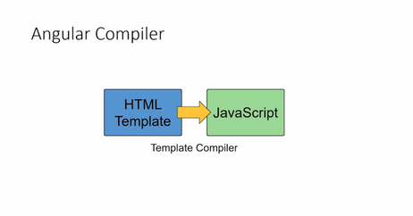
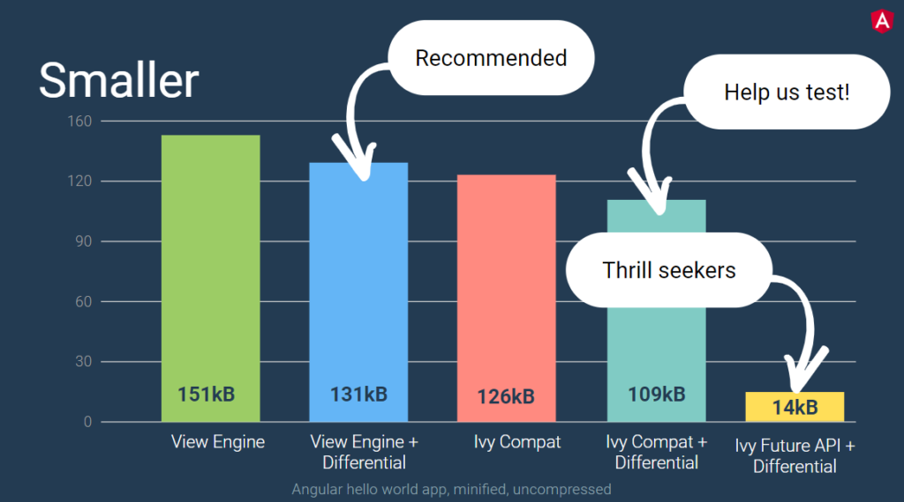
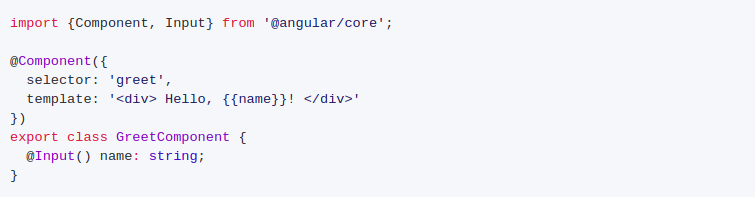
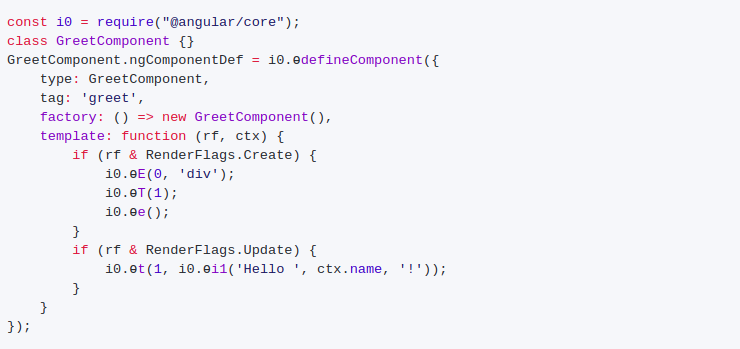
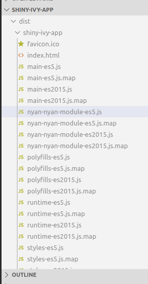

> Originally published at [https://mquanit.netlify.com](https://mquanit.netlify.com/blog/future-of-angular-with-ivy) on December 07, 2019.

### According to Angular Official Team,
> Ivy is the code name for [Angular's next-generation compilation and rendering pipeline.](https://blog.angular.io/a-plan-for-version-8-0-and-ivy-b3318dfc19f7)

but that's not enough to grasp it as a beginner or if you don't know how angular compiler works.




So let's check how it works under the hood. Till version 4.0, Angular is compiling your HTML templates into JavaScript. In order to make JavaScript more performant, Ivy is the new compiler for this. There has been a compiler doing this and now we have Ivy which is trying to do this in a better way and one of the nice things is that Ivy leads to up to 40% less bundle size which is quite awesome.

if you ask me you have the same application but the bundle size is up to 40% smaller which of course reflects into a better startup performance and so on and so forth.





According to the statistics presented this year at ng-conf and the statistic shows several things on the left side you see bundle sizes for a simple hello world application than using the so-called view engine. The view engine is the predecessor of Ivy. The first part is using a view engine only & the second part is about using view engine together with <strong>differential loading</strong>.

<strong>Differential loading</strong> means that your browser gets an optimized bundle if the browser is supporting ECMA script 2015 it gets an optimized ECMA script 2015 bundle if it is not supporting ECMA script 2015, I think we all know about which browser I'm talking then it gets an ECMA script 5 bundle and so when going with ECMA script 2015 we can spare some bytes and so a hello world application here has about 131 kilobytes which are quite big if you ask me for a hell of a health application & then we are using Ivy with differential loading, we can spare about 20 kilobytes which is a good start but there is even more into this namely if you look at the last part above for thrill-seekers then you see the true potential of Ivy.

### But Why Ivy?

The thing a lot of developers don't really know is that this HTML will never touch the browser. It will be compiled by Angular into JavaScript instructions, to create the appropriate DOM when the component appears on the page, and to update the component when its state changes. That's why a big part of Angular is its compiler: it takes all your HTML and generates the necessary JS code. This compiler (and the runtime) has been completely rewritten over the last year, and this is what Ivy is about.


Angular achieves the same with this effort: Ivy is a complete rewrite of the compiler (and runtime) in order to:

* 🚀 reach better build times (with a more incremental compilation)
* 🔥 reach better build sizes (with a generated code more compatible with tree-shaking)
* 🔓 unlock new potential features (metaprogramming or higher-order components, lazy loading of the component instead of modules, a new change detection system not based on zone.js..)

### No Effort From Your Part

The important point is that we don't have to change how we write our applications. Ivy aims to be compatible with the existing applications: it will just be a switch to turn on for most projects. But it can happen that Ivy does not have the exact same behavior for some edge cases. To avoid breaking applications when we switch to Ivy, the Angular team wrote migration scripts (update schematics) to analyze your code and prepare it for Ivy if necessary. So when you'll update to Angular 8, the schematics will run and tweak a few things in your code to be ''Ivy-ready'' when the time comes. The plan is to enable Ivy by default in the future, probably in V9.

Now there are two ways to enable Ivy in your project. Either you could create a new project with Ivy enabled or enable Ivy in the existing Project.

### Using Ivy in a new project

To start a new project with Ivy enabled, use the <b> --enable-ivy </b> flag with the ng new command:

``` 
ng new shiny-ivy-app --enable-ivy 
```

The new project is automatically configured for Ivy. Specifically, the enable Ivy option is set to <b>true</b> in the project's <b>tsconfig.app.json</b> file.

### Using Ivy in an existing project

To update an existing project to use Ivy, set the <b>enableIvy</b> option in the <b>angularCompilerOptions</b> in your project's <b>tsconfig.app.json</b>

```
{
  "compilerOptions": { ... },
  "angularCompilerOptions": {
    "enableIvy": true
  }
}
```
AOT compilation with Ivy is faster and should be used by default. In the <b>angular.json</b> workspace configuration file, set the default build options for your project to always use AOT compilation.


```
  {
  "projects": {
    "my-existing-project": {
      "architect": {
        "build": {
          "options": {
            ...
            "aot": true,
          }
        }
      }
    }
  }
}
```

<b>Note:</b> Ahead-of-Time (AOT) Compiler works under the hood for Ivy in compiling Angular HTML and TypeScript code into efficient JavaScript code during the build phase before the browser downloads and runs that code. Compiling your application during the build process provides a faster rendering in the browser.


### Generated Code Difference

Angular has introduced two compiler entry-points, <b>ngtsc</b> and <b>ngcc</b>.

* <b>ngtsc:</b> This will be a Typescript-to-Javascript transpiler that concretes Angular decorators into static properties. It is a minimal wrapper around tsc which includes a set of Angular transforms. Note:- While Ivy is experimental ngc operates as ngtsc when the angularCompilerOption enableIvy flag is set to true in the tsconfig.json file for the project.

* <b>ngcc (Ng Compatibility Compiler):</b> ngccis designed to process code coming from NPM modules and produce the equivalent Ivy version, as if the code was compiled with ngtsc . It will operate given a node_modules directory and a set of packages to compile, and will produce an equivalent directory from which the Ivy equivalents of those modules can be read. ngcc is a separate script entry point to @angular/compiler-cli.

For example, the following class declaration:



The above code will be emitted as following by <b>ngtsc</b>:



And if you compile with your app with ``` ng build ``` you will see compiled files like this,



Every module or file contains <b>es5.js & es2015.js</b> version because it uses differential loading and differential loading makes a bundle for every Javascript version according to the browser.

### Future Possibilities  

Angular 8.0 is really the first step for Ivy & Angular 9.0 is all around the corner, and Ivy will become the default rendering engine. And then the team can start working on adding other features more easily. Like the i18n service, probably one of the most awaited features. Or the possibility to have metaprogramming or higher-order components. Or to lazy-load a single component instead of a module. Or to have JiT components and AoT components work with each other. Or to manually craft a template, by hand-writing the generated instructions to squeeze the best performances. And probably tons of other ideas the team has, and have not talked about yet.

I hope this clarified a bit what Ivy is about, and that you'll give it a try.

Since Ivy is not featured completely, we can check the status on: [https://is-angular-ivy-ready.firebaseapp.com/#/status](https://is-angular-ivy-ready.firebaseapp.com/#/status)


<!-- If you still have any questions, do not hesitate to contact on [muhammadquanit@gmail.com](mailto:muhammadquanit@gmail.com) and check my other articles on my [Official blog site: ](https://technopreneur31.blogspot.com/) -->

## If this post was helpful, please do check my [github](https://github.com/Mohammad-Quanit) and follow me on [twitter](https://twitter.com/mquanit).

## I will write more blogs on Angular, Web Technologies, Flutter & Cloud Stuff.

<!-- ```js
function helloWorld() {
  console.log("Hello World!")
}
``` -->
