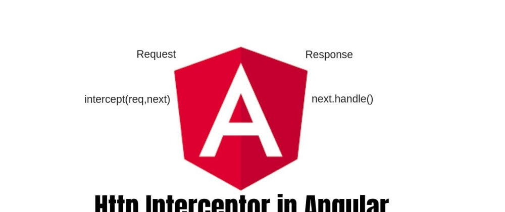

Hola guys, In this article we're going to look into HTTP interceptors in Angular and how to best use them.

So what are <b>HTTP interceptors</b>?

<b>Interceptors</b> is a way to communicate with any incoming or outgoing request. We mostly use the <strong>Http Interceptor</strong> in angular app for incoming or outgoing HTTP requests. when you make a request using <b>HTTP interceptors</b> to intercept and modify the request as you like it, in other words, you can mutate your outgoing requests, mutation means that you can add a property in your outgoing request or you can add a custom header to your outgoing requests.

Most interceptors transform the outgoing request before passing it to the next interceptor in the chain, by calling `next.handle(transformedReq)`. An interceptor may transform the response event stream as well, by applying additional RxJS operators on the stream returned by `next.handle()`.


Now from the technical perspective, <b>HTTP interceptors</b> is an interface, which takes `HttpRequest<any>` as a parameter and returns an [Observable of Http event](https://scotch.io/tutorials/angular-2-http-requests-with-observables).

So enough talk, let's dive into some code.

First, create an angular app by typing the command in command prompt or terminal if you are Linux user:

```javascript
ng new my-dream-app 
```

Now, this script will create a new angular app in your machine, but it's not mandatory. If you have already created a project in the past you can play within it as well. 

But, if you are too lazy to do all that stuff, you can live code online on 
[stackblitz.com](https://stackblitz.com).


For our example, we will add a custom <strong>request header</strong> via <b>HTTP interceptors</b>. And for creating our HTTP interceptor, first, create a file under the `src/app` folder named `Http-interceptors`. By the way, it could be any name, I just prefer this name for the folder.

Now in the folder, create a file name `auth-headers.ts`. This is the file where we create our interceptor by utilizing `intercept interface`.

Now copy & paste the below code in your `auth-headers.ts` file.

```javascript

// auth-headers.ts

import { Injectable } from '@angular/core';
import { HttpInterceptor, HttpRequest, HttpHandler } from '@angular/common/http';

@Injectable()
export class AuthHeadersInterceptor implements HttpInterceptor {
  intercept(request: HttpRequest<any>, next: HttpHandler) {
    console.log('Auth interceptor');
    console.log(request.url);
    const authToken = "mytoken";
    const authReq = request.clone({ setHeaders: { Authorization: authToken } });
    return next.handle(authReq);
  }
}
```

HTTP interceptor is fairly straightforward all you need to do is create a class with an injectable decorator that implements an HTTP interceptor. HTTP-interceptor so basically this will hold all sorts of intercepting concepts embedded in inside this folder so we're not going to chuck every all kinds of Interceptor into one single class we're going to separate them.

As our `AuthHeadersInterceptor` class implements `HttpInterceptor` interface, we must have to implement `intercept` function, which takes 2 parameters, `HttpRequest<any>` and `HttpHandler`.

<h2>HttpRequest</h2>

`HttpRequest` represents an outgoing request, including URL, method, headers, body, and other request configuration options. Instances should be assumed to be immutable. To modify an HttpRequest, the `clone` method should be used.

<h2>HttpHandler</h2>

`HttpHandler` is injectable. When injected, the handler instance dispatches requests to the first interceptor in the chain, which dispatches to the second, etc, eventually reaching the HttpBackend.

This `interface` method must return an `Observable` of `HttpEvent` in  the form of `next.handle(authReq)`.

Now we'll create a service for getting data from [dummy API](https://jsonplaceholder.typicode.com/todos) for getting some data and mutating/adding custom header name `Authorization`, which mostly used for user login or registration operations.

```javascript
ng g s http-test
```

This script will create, service named `HttpTestService` class in which we will implement `HttpClient` for fetching data from API.


```javascript
// http-test.service.ts

import { Injectable } from '@angular/core';
import { HttpClient } from '@angular/common/http';

@Injectable({
  providedIn: 'root'
})
export class HttpTestService {

  constructor(private http: HttpClient) { }

  fetch() {
    return this.http.get("https://jsonplaceholder.typicode.com/todos");
  }
}

```

Now, we'll use inject this service in our component file.


```javascript

// app.component.ts

import { Component } from '@angular/core';
import { HttpTestService } from './http-test.service';

@Component({
  selector: 'app-root',
  templateUrl: './app.component.html',
  styleUrls: ['./app.component.css']
})
export class AppComponent {

  constructor(private testService: HttpTestService) {}

  title = 'Http Interceptor App';

  fetch() {
    this.testService.fetch().subscribe(data => console.log(data));
  }
}

```
There is nothing unique in the above code. We just simply fetching our data by using the Observable `subscribe` method, which you probably know it.

We get this data on click the button event.

```html
<button (click)="fetch()">Click to get data</button>
```

<b>Note</b>: Make sure to add `HttpClientModule` in `app.module.ts` file so that you can use Http methods in your app.

Now if you open your app by typing `ng serve -o` and click the button. If you don't see the `console.log()` from the `interceptor` class, there is one probably most important step missing. 

Create another file named `index.ts` in the `http-interceptors` folder, which we created earlier and copy the below code in that file.

```javascript
// http-interceptors/index.ts

import { HTTP_INTERCEPTORS } from "@angular/common/http";
import { AuthHeadersInterceptor } from './auth-headers';

export const httpInterceptProviders = [
  { provide: HTTP_INTERCEPTORS, useClass: AuthHeadersInterceptor, multi: true }
];

```

These are the `http-interceptor provider` which we have to include in our `app.module.ts`. So that our app knows what kind of interceptor our app using which angular compiler usually bootstrap it.

So your `app.module.ts` finally look like this:

```javascript
// app.module.ts

import { BrowserModule } from '@angular/platform-browser';
import { NgModule } from '@angular/core';

import { AppRoutingModule } from './app-routing.module';
import { AppComponent } from './app.component';
import { ViewTodosComponent } from './view-todos/view-todos.component';
import { TodosListComponent } from './todos-list/todos-list.component';
import { HttpClientModule } from '@angular/common/http';
import { SingleTodoComponent } from './single-todo/single-todo.component';
import { httpInterceptProviders } from './http-interceptors';


@NgModule({
  declarations: [
    AppComponent,
    ViewTodosComponent,
    TodosListComponent,
    SingleTodoComponent,
  ],
  imports: [
    BrowserModule,
    AppRoutingModule,
    HttpClientModule
  ],
  providers: [httpInterceptProviders],
  bootstrap: [AppComponent]
})
export class AppModule { }

```

When you click the button for getting data, you'll see consoles from the `auth-headers.ts` file.


And if you go to <b>Network tab</b> in chrome dev tools, after click you'll see in <b>Request Headers</b> section a property named `Authorization` which we have add in interceptor file. 


So, now you know how to create an `http-interceptor`. You can create for any kind of interceptor like for global error handling. 

If you have any queries you can ask or suggest anything you want & please don't forget to follow me here.

✌🏻✌🏻 Peace ✌🏻✌🏻