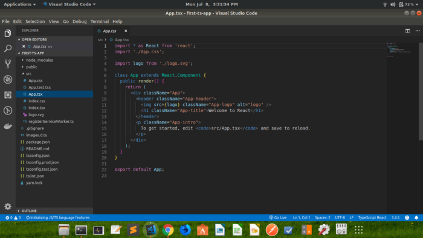
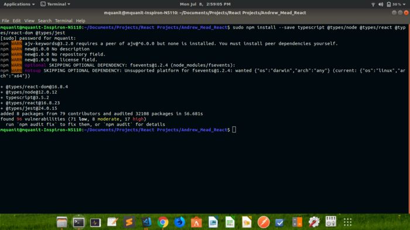
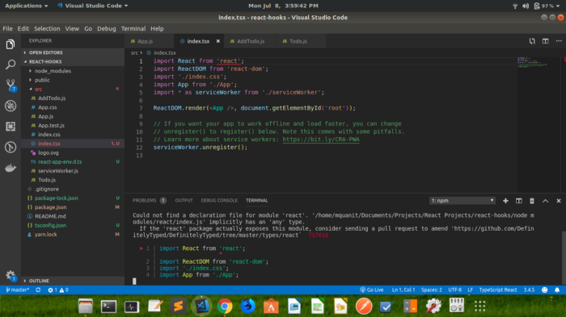
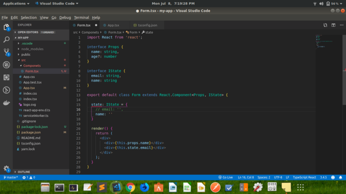
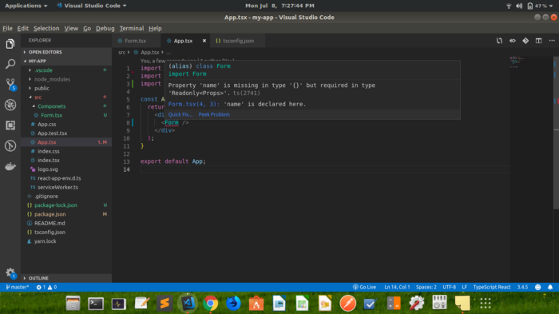
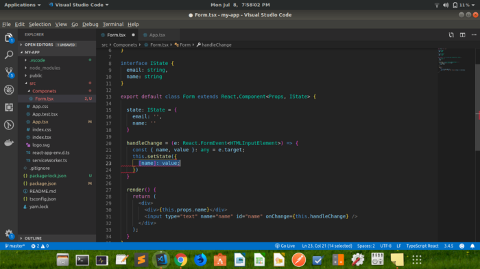
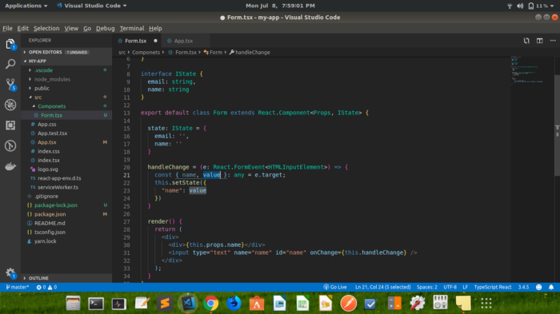

In this article, we will see how to use typescript with React.js. As a javascript developer, everybody should know what typescript is. Well, Typescript or [Microsoft TypeScript](https://www.typescriptlang.org/docs/home.html) is an open-source programming language developed and maintained by Microsoft. It is a strict syntactical superset of JavaScript and adds optional static typing to the language. TypeScript is designed for development of large applications and transcompiles to JavaScript.

### _But why should we bother to use Typescript with React?_

Well, As you all know, JavaScript has no types, so it’s hard to control all the parameters and variables that we are using and validate them. It’s really easy to make mistakes on your code like forgetting to declare a variable, calling a non-existing function or passing as a parameter a variable that will break all our code. So we can say that TypeScript is like JavaScript, but with types. It helps make our code easier to read and avoid errors that may become a debugging nightmare.

## **_There are two sections in this article._**

1.  First, we will create react project with typescript from scratch.
2.  Second, we will convert the existing Javascript project into typescript project.

## Create a TypeScript Project From Scratch.

For creating a typescript project from scratch, we will use ‘create-react-app’ cli provided by Reactjs. So, open your command prompt in a specific directory and type:

> npx create-react-app first-ts-app — scripts-version=react-scripts-ts

By typing this command, your React and typescript project will be created. If you are using ‘Yarn’ then type above command and replace npx with yarn.

After creating your project, open your project in your favorite code editor as my favorite is vs code and you will see that there are no more .js files in the src folder.

#### Note: By using npx, if create-react-app is not installed, it will automatically installed create-react-app and create a project with ts.



Ok, So now you know how to create react app with typescript but if you want to convert an existing project into typescript, which you probably need to if your organization want, then there some scripts which can do this work lot easier.

### Converting an existing Project into Typescript.

To add [TypeScript](https://www.typescriptlang.org/docs/home.html) to an existing Create-React-App project, first install it:

> npm install — save typescript @types/node @types/react @types/react-dom @types/jest

Now this command will add Typescript locally in your existing projects.



### Note: If you are on windows, you don’t have to type ‘sudo’. Mac & Linux users have to type this for some reason.

After installing these dependencies, rename your `index.js` file to `index.tsx` and start the server by `npm start`. While starting the server it will ask you to include `tsconfig.json`. just type `y` for yes and that's it. Now you have typescript configured in your project. But you will notice there are zillions of error. The first error you will see,



Well, in React, it does not export anything by default, so it means you cannot just import anything like this. so you have to write like this for importing react or any other third party library.

> import \* as React from ‘react’;

Now We know how to create or include typescript with our react project, let’s see, how we can work with it.

As there are many features which are not provided by javascript but included in Typescript like interfaces, static typing, support for modules, optional parameter functions.

Let's see, how to create an interface,



As you can see, we have created two interfaces Props and IState, when IState type is provided to state object It immediately wants IState properties in the state object. So you have to provide all properties if they are not set optional.

Another thing is that when you use this component in `App.tsx`, you have to provide the prop name with value otherwise it won't compile and gives you an error. <b> (Property name is missing in type {} but required in type Readonly &lt; Props &gt;) as shown in below figure. </b>.



And yes, you cannot add another prop apart from name & age.

You can set function parameter types as well. If you are using input and playing with onchange you can pass the event parameter with a type of <b> React.FormEvent &lt; HTMLInputElement &gt; </b>. But when you try to update state via setState you simply cannot write.

> this.setState({[e.target.name]: e.target.value;})

because we have provided IState interface above and it needs email and name property. It cannot work in generically.



### So you have to write like this, to change state.



Btw, it’s just basic of react and typescript, if you want more of this kinda content just follow my profile & if you like it, please do click clap button.
If you still have any questions, do not hesitate to contact on [muhammadquanit@gmail.com](mailto:muhammadquanit@gmail.com) and check my other articles on my [Official site: ](https://mquanit.netlify.com/blog/)

## If this post was helpful, please do check my [github](https://github.com/Mohammad-Quanit) and follow me on [twitter](https://twitter.com/mquanit).

## I will write more blogs on Javascript, Flutter & Cloud Computing.

<!-- ```js
function helloWorld() {
  console.log("Hello World!")
}
``` -->
